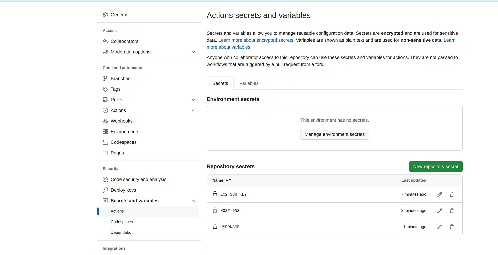

# flask-aws-ec2-cd-pipeline
Continous Delivery Pipeline For  Flask deployment to EC2 
You need to adjust some credentials:
EC2_SSH_KEY: This is from .pem file. 
HOST_DNS: Public DNS record of the instance, it looks like ec2-xx-xxx.us-west2.compute.amazonaws.com 
USERNAME:Will be the username of the EC2 instance, usually ec2-user or ubuntu depending on the operating system you choose.

